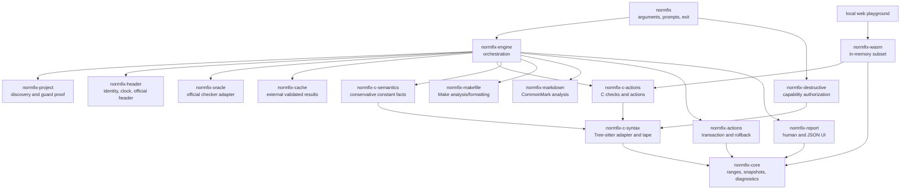
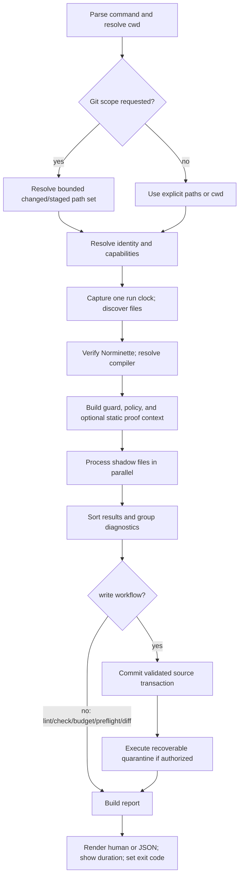

# Architecture

This document describes the native Rust architecture implemented by
`normfix` `1.3.0`. It records both what the system does and why
the boundaries exist. Where a useful library exists but is not part of the
default CLI pipeline, that distinction is explicit.

The governing rule is:

> Change what can be proven, explain what cannot, and never turn uncertainty
> into permission.

## Product constraints

`normfix` is not a general C rewriter. It operates under a combination
of unusually strict constraints:

- the 42 Norm defines physical layout, including real tabs and an 80-column
  limit;
- the official Norminette remains the compatibility authority students are
  evaluated against;
- C syntax alone is not enough to prove project-wide semantic changes;
- comments, preprocessing, line splices, Make recipes, and official headers
  make whole-file reprinting risky;
- a useful tool must still process a complete project quickly and produce
  deterministic output;
- deletion must be explicit and recoverable.

These constraints favor a conservative, layered transformation engine over a
single parser/formatter pass.

## Decisions at a glance

| Choice | What | Why | Principal tradeoff |
|---|---|---|---|
| Native Rust workspace | Small crates with explicit ownership | Strong types, predictable performance, one deployable binary, and enforceable boundaries | More integration code than a monolithic script |
| Prebuilt Unix release archives | Publish one checked binary for Linux x86-64/ARM64 and macOS Intel/Apple Silicon | Students can install without compiling the workspace | Each target needs a trusted native release runner; Norminette remains an external dependency |
| Windows through WSL or the browser | Keep the full CLI on its tested Unix process/filesystem boundary; offer the WASM preview in any modern browser | Avoids claiming native Windows safety before subprocess termination and transaction proofs exist there | Windows users need WSL for the full Norminette-backed workflow |
| Immutable shadow buffers | Analyze and edit strings in memory before any write | Failed proofs cannot partially mutate a source file | Temporary memory scales with selected source size |
| Tree-sitter behind an adapter | `tree-sitter-c` provides resilient C structure | Fast parsing and useful ranges without coupling every crate to one backend | Tree-sitter is not a compiler and can recover around valid macro-heavy C |
| Lossless token tape | Every byte is classified as token, trivia, or unknown | Structural parsing must not discard whitespace/comments required by the Norm | A second lexical representation must be maintained |
| Targeted source edits | Rules replace narrow UTF-8 byte ranges | Preserves untouched source and keeps diffs reviewable | Cannot normalize every construct as aggressively as a whole-file printer |
| Fixed-point action scheduler | Apply one validated batch, reparse, then continue | Later actions see current ranges and convergence is testable | Repeated parsing costs more than a single unchecked rewrite |
| Official checker as oracle | Require and verify Norminette 3.3.59 | Compatibility output, not an approximation, decides evaluator-facing regressions | The run depends on an external Python tool |
| Native diagnostics beside official diagnostics | Structural limits and explanations use a shared schema | Better English guidance without pretending native rules replace the oracle | Similar facts may come from more than one producer and need deduplication |
| Conservative semantic facts | Resolve only provable enum/integer bounds | Correctly explains known `VLA_FORBIDDEN` false positives | It is intentionally not full C constant evaluation |
| Parallel files, sorted effects | Rayon processes independent files; results and writes are sorted | Uses available cores without making output nondeterministic | Cross-file proof phases still need serial/global snapshots |
| External content-addressed cache | redb database keyed by all relevant deterministic inputs | Avoids repeated official checker calls without dirtying projects | Cache invalidation inputs must remain complete |
| Dedicated Makefile and Markdown paths | GNU Make and CommonMark are not treated as C | Each language gets an appropriate safety policy | Behavior differs by file kind |
| Diagnostics-only compiler preflight | Run `cc -fsyntax-only -Wall -Wextra -Werror` and a bounded GCC/Clang analyzer independently of edit approval | Finds build-relevant mistakes and possible leak paths without letting an incomplete guessed build context authorize formatting | Project-specific defines, language mode, generation, linking, and runtime tests remain external |
| Explicit Git scopes | Resolve `--changed`/`--staged` through bounded NUL-delimited Git subprocesses | Review can target the same version-control state the student intends | Git state is a selection mechanism, not a completeness proof |
| Narrow project policy with a closed proof | Parse only an allowed-function list, then resolve definitions from a complete C/header snapshot | Subject rules become machine-checkable without embedding every 42 subject or trusting a partial Git/path scope | One unreadable, recovered, or changed project source disables all allowlist findings for the run |
| Capability-scoped destructive grants | Authorization names a closed operation set | `--unsafe` cannot become an open “do anything” switch | Confirmation occurs before candidate planning |
| Recoverable transaction boundary | Preflight, backup, stage, journal, ordered commit, rollback | Filesystem changes have one auditable owner | Multiple files cannot be made truly atomic by a single cross-file rename |
| One reporting layer | Human UI and stable JSON derive from the same report model | Terminal and automation consumers see the same facts | Report schema evolution must be deliberate |
| Browser-only WASM subset | Reuse native parser/actions in memory behind a small old-school Vite 8.1.5 workbench | A local or Vercel-hosted playground can preview code privately without installing the CLI | It cannot claim official Norminette, compiler, Git, header, or transaction results |

## System shape



The engine is the only layer that composes every subsystem. Rule and parser
crates do not write files. The report crate does not decide whether an edit is
safe. The transaction crate does not understand C. This separation is the main
safety mechanism, not just a code-organization preference.

## Crate responsibilities

### `normfix-core`

What it owns:

- compact UTF-8 byte offsets (`TextSize`) and half-open ranges (`TextRange`);
- immutable `SourceSnapshot` values and line indexes;
- deterministic diagnostics, fixes, source edits, applicability, and proof
  vocabulary;
- validation and application of non-overlapping edits.

Why:

These types must be independent of Tree-sitter, Norminette, Comrak, redb, and
terminal rendering. A backend-neutral core prevents a parser-specific node or
database record from becoming the long-term public data model.

Important invariants:

- `start <= end`;
- offsets are UTF-8 byte offsets, not character indexes;
- ranges must land on character boundaries before replacement;
- exact duplicate edits may collapse, but every other overlap rejects the
  complete batch;
- diagnostics have a total ordering.

### `normfix-project`

What it owns:

- zero/one/many input discovery;
- deterministic sorting and deduplication;
- `.c`, `.h`, case-insensitive `Makefile`, and README classification;
- unexpected-file reporting;
- `.normfixignore`, its legacy `.norminetteignore` alias, optional `.gitignore`,
  `.git`, and symbolic-link policy;
- bounded Git-state path resolution for `--changed` and `--staged`;
- strict parsing of the optional `normfix.toml` allowed-function policy;
- closed-worktree inclusion-guard insertion and rename approvals.

Why:

Path traversal is a security and correctness boundary. A formatting rule
should never decide whether a symlink escape, ignored file, or `.git` path
belongs to the project.

Git scope selection and complete-project proof discovery intentionally use
different policies. Git scopes omit symbolic-link and non-file candidates and
fail on unsafe names or metadata errors; they are a convenient subset for
review. Guard, static-removal, and function-policy proofs rescan the project
under their stricter closed-world rules instead of treating that subset as
complete evidence.

### `normfix-c-syntax`

What it owns:

- the `tree-sitter-c` adapter;
- parser recovery regions;
- a full-fidelity token/trivia tape;
- backend-neutral facts for functions, calls, parameters, local declarations,
  macros, arrays, enums, controls, and preprocessors.

Why:

Tree-sitter is useful implementation machinery, but its node types and lifetime
model should not leak into rules or reports. The crate exposes stable facts and
text ranges instead.

### `normfix-c-semantics`

What it owns:

- a deliberately small integer constant-expression evaluator;
- enum value resolution in source order;
- array-bound classification as constant, variable, incomplete, or unknown.

Why:

Norminette 3.3.59 can lexically classify an enum-sized array as a VLA. A narrow
semantic layer can prove this specific distinction without claiming to
implement the C compiler.

### `normfix-c-actions`

What it owns:

- native C structural diagnostics;
- ordered formatting phases;
- source hygiene;
- fixed-point scheduling;
- token/comment fingerprints and candidate reparse checks;
- conservative 80-column wrapping and continuation packing.

Why:

Rules need one place where edits, syntax context, applicability, and local
proofs meet. Keeping this crate independent of CLI and filesystem writes makes
the same action engine usable by check, diff, fix, and tests.

### `normfix-header`

What it owns:

- 42 identity resolution and validation;
- one-shot/reproducible run clocks;
- exact 80-byte C header construction;
- exact Make-independent inclusion-guard recognition primitives.

Why:

The official header is fixed-width metadata, not ordinary C formatting.
Identity ambiguity and field truncation need fail-closed rules shared by C and
Makefile support.

### `normfix-makefile`

What it owns:

- exact `#`-style official headers;
- source-assignment compaction;
- literal source-reference reconciliation;
- conservative Makefile diagnostics.

Why:

GNU Make whitespace is executable syntax. Reusing the C whitespace formatter
would corrupt recipes and continuations.

### `normfix-markdown`

What it owns:

- Comrak parsing;
- lightweight README diagnostics;
- canonical CommonMark reprinting, enabled by default and explicitly
  suppressible.

Why:

README files are expected project content. Canonical Markdown output is
deterministic and enabled by default, but can produce a broad first-run diff;
`--no-format-markdown` preserves the original bytes while retaining analysis.

### `normfix-oracle`

What it owns:

- executable resolution and exact version verification;
- bounded, shell-free process execution;
- isolated temporary source materialization;
- strict parsing of official output;
- in-memory report caching;
- significant-token proof helpers;
- the strict C compiler adapter and optional GCC analyzer backend.

Why:

External tools are operational dependencies, not rule implementations. Their
timeouts, output protocols, versions, and failures need a boundary separate
from source diagnostics.

The strict compiler adapter is invoked by default for C sources, with stable
include directories inferred from discovered headers. It is diagnostics-only
and fail-open because project-specific language modes, defines, generated
headers, target flags, and build commands cannot be inferred safely. Optional
GCC `-fanalyzer` output follows the same boundary and never becomes leak proof.

### `normfix-cache`

What it owns:

- BLAKE3-derived deterministic cache keys;
- canonical JSON payload fingerprints;
- redb transactional storage;
- corruption quarantine and fail-open behavior.

Why:

The cache is an acceleration layer. It must be impossible for a cache lock or
corrupt record to turn a clean source into an error or alter a proposed diff.

### `normfix-destructive`

What it owns:

- non-forgeable, capability-scoped authorization values;
- closed-source-set unreachable-`static` planning;
- immutable quarantine snapshots and plans.

Why:

Deletion needs stronger preconditions than formatting. The planner is
read-only and cannot execute its own result, so “analysis believes this is
dead” never directly becomes `remove_file`.

### `normfix-actions`

What it owns:

- validated multi-file replacement plans;
- external backups and transaction journals;
- preflight/concurrent-modification checks;
- same-directory staging;
- stable-order commit and rollback;
- hash-checked listing and restoration of completed runs for `normfix undo`.

Why:

All source writes need one implementation with one set of filesystem
invariants. A formatter must not have a convenient direct-write escape hatch.

### `normfix-report`

What it owns:

- the versioned run-report schema;
- file status and summary calculation;
- source-aware human diagnostics;
- default grouping by rule, severity, and producer while retaining every
  location;
- ANSI policy, unified diffs, and duration rendering;
- deterministic pretty JSON.

Why:

Diagnostic producers should describe facts, not terminal aesthetics.
Centralizing rendering keeps human and machine output aligned.

### `normfix-engine`

What it owns:

- end-to-end pipeline order;
- cross-crate shadow-buffer validation;
- thread-pool selection and deterministic aggregation;
- transaction scheduling;
- allowed-function and compiler diagnostic composition;
- per-file failure isolation and run-level report construction.

Why:

No leaf crate has enough context to decide that a proposal is ready to commit.
The engine is the policy composition point.

### `normfix` CLI package

The package lives in `crates/normfix-cli`; the directory retains the
responsibility-oriented workspace layout while the published executable and
Cargo package use the product name.

What it owns:

- Clap argument validation;
- command workflows (`format`, `lint`, `check`, `budget`, `preflight`,
  `explain`, and `undo`);
- interactive identity, per-file review, undo, and destructive-capability
  prompts;
- Git scope selection before normal discovery;
- conversion to `FixOptions`;
- color/TTY selection;
- final exit code.

Why:

TTY interaction and command-line convenience should not be required by the
engine API or rule tests.

### `normfix-wasm`

What it owns:

- a bounded JSON-compatible request/response model for in-memory `.c` and `.h`
  files;
- reuse of native C formatting, diagnostics, function budgets, and unified
  diff generation;
- the `wasm-bindgen` entry point used by the local static playground.

Why:

The browser is useful for low-friction experimentation, but it is a different
trust environment. This crate has no filesystem, process, Git, compiler,
identity, header, backup, or network-upload capability. The separation makes
those absent capabilities visible in the response instead of silently
pretending a native preview is an official evaluation. Build and serving
instructions live in [`web/README.md`](../web/README.md). The frontend is a
plain HTML/CSS/TypeScript workbench built with pinned Vite 8.1.5; Vercel serves
only its static output. Keeping the UI old-school and dependency-light reduces
the browser supply-chain and runtime surface, at the cost of editor features
provided by larger web IDE frameworks.

The playground is also installable and works with no network. Because nothing
was ever uploaded, offline support does not change what the tool does — only
how a reader reaches it — so it is an honest promise rather than a degraded
mode. Both decisions it depends on live in `web/precache.ts` as pure functions:
which built files must exist before the shell can start, and which requests the
service worker may answer at all. The precache list is derived from the real
bundle at build time, because a hand-written list of content-hashed URLs would
go stale in the worst possible way — an install that succeeds and caches the
previous build.

Two boundaries are deliberate. Monaco is reached only through dynamic imports
and is therefore excluded from the install: it would roughly double a first
visit to buy syntax highlighting, and the textarea path formats identically, so
it is cached opportunistically once a reader has actually loaded it. And the
worker answers only for the playground's own pages and hashed assets; the
documentation site shares the origin and is passed through untouched, since a
stale cached document is worse than a missing one.

## Core source model

### UTF-8 ranges

All internal ranges are half-open UTF-8 byte spans:

```text
[start, end)
```

Line, byte column, and visual column are derived views. Visual columns use
four-column tab stops. This choice matches the checker-facing location model
while keeping slicing unambiguous.

The compact `u32` representation rejects inputs too large to represent rather
than overflowing. The tradeoff is a practical single-file size ceiling far
above normal 42 projects.

### Immutable snapshots

Analysis works from immutable source text and content hashes. An action never
mutates the snapshot it was derived from; it creates a new shadow string. The
filesystem transaction later verifies that disk bytes still equal the
captured original.

This closes the time-of-check/time-of-use gap as far as a user-space
transaction can: if another process edits a file after analysis, the preflight
rejects the write.

## Why Tree-sitter is paired with a token tape

Tree-sitter provides structure, recovery, and byte ranges, but its syntax tree
does not by itself own every ignored whitespace byte. Norm compliance depends
on those ignored bytes. The architecture therefore uses two complementary
views:

```text
Tree-sitter tree: structure, named constructs, parser recovery
Token tape:       complete byte ownership and reconstructability
```

The tape classifies:

- grammar tokens;
- spaces;
- tabs;
- LF and CRLF;
- line and block comments;
- escaped newlines;
- UTF-8 BOM;
- unknown non-trivia regions.

Its invariants are:

1. pieces are in source order;
2. pieces are contiguous;
3. pieces do not overlap;
4. every range is a UTF-8 boundary;
5. concatenating the piece text reconstructs the original source exactly.

`ERROR`, `MISSING`, or `Unknown` does not mean “probably editable.” Any of them
blocks syntax-aware automatic actions for the file. The bytes remain
reportable and recoverable, but they do not supply evidence.

This is stricter than a conventional resilient editor formatter. The tradeoff
is fewer fixes on macro-heavy or malformed files in exchange for a clear
non-corruption boundary.

## Backend-neutral syntax and semantic facts

Rules consume facts such as:

- function definition/prototype, name range, signature, body, `static` flag,
  and parameter count;
- array declarator and bound range;
- enum name/value expressions grouped by enum;
- preprocessor-owned ranges.

They do not traverse raw Tree-sitter nodes. This keeps parser replacement or
grammar-version adaptation local to `normfix-c-syntax`.

The semantic evaluator intentionally supports only the integer-expression
surface it can prove. A result is one of:

```text
Constant(value)
Variable
Incomplete
Unknown(reason)
```

`Unknown` is a first-class safe outcome. It is not coerced to variable or
constant. This is how `count[op_total]` can be explained correctly when
`op_total` resolves in the same translation unit, without making claims about
arbitrary macros, typedef environments, or linker behavior.

## Selection and project policy

Normal path discovery accepts zero, one, or many explicit inputs. Git scopes
are resolved before discovery and cannot be mixed with explicit paths:

- `--changed` combines the unstaged working-tree diff with untracked,
  non-ignored files;
- `--staged` reads only the index diff to choose names, then processes their
  current working-tree bytes without modifying or staging the index.

Git output is NUL-delimited so unusual names remain unambiguous. The subprocess
has a wall-clock timeout and combined-output cap and uses no shell. Absolute,
empty, or parent-traversing names reject the whole requested scope. Candidate
symbolic links and non-files are deliberately omitted; failure to inspect a
candidate is reported as a scope error, and a symbolic-link scope root is
rejected explicitly. This prevents traversal while making the tradeoff
explicit: Git scope is a review subset, never a completeness proof. An empty
result is a successful no-op and is represented explicitly so the engine
cannot reinterpret it as the usual empty-argument “scan cwd” input.

`normfix.toml` is a deliberately narrow subject-policy surface:

```toml
[project]
name = "push_swap"
allowed = ["read", "write", "malloc", "free"]
```

The dependency-free bounded parser interprets quoted values for only the
relevant keys and refuses a symlinked, oversized, changing, or non-UTF-8
policy. For every selected C/header workflow, the engine separately discovers
the complete eligible regular-file project C/header set without following
symbolic links and with `.gitignore`, `.normfixignore`, and `.norminetteignore`
filtering disabled. It reads and losslessly parses every member, records
content digests, and revalidates both the file set and policy snapshot before
emitting findings.

Only non-`static` project definitions authorize a call from another
translation unit. Same-file definitions are removed while analyzing that
file; a `static` function elsewhere cannot create a false exemption. Candidate
calls are computed from each final shadow buffer, after header and formatter
changes, so diagnostic ranges address the source shown in the report.
Function-pointer parameters, local callable variables, macro-like identifiers,
and preprocessor ambiguity remain excluded conservatively. Any incomplete
discovery, read, UTF-8 decode, parse, lossless tape, or snapshot check disables
all `FUNCTION_NOT_ALLOWED` findings and emits
`FUNCTION_POLICY_PROOF_INCOMPLETE`. This biases toward a missed warning instead
of accusing permitted code without complete evidence.

## End-to-end pipeline

One CLI run follows this sequence:



### Run-wide prerequisites

The clock, worker pool, and verified official checker are run-wide
prerequisites. Failure here returns exit code 2 before source commit. The
compiler is deliberately different: inability to construct a reliable
compiler invocation is a visible advisory and cannot prevent independently
proven formatting.

The tested official version is exact, not a minimum: `3.3.59`. A different
release may change rule names, columns, or output grammar, so the fingerprint
enters persistent-cache keys and the report emits a compatibility advisory.
Pinned CI can convert that advisory into refusal with strict version mode.

### Global proof context

Before per-file formatting, the engine prepares:

- candidate header-guard insertion/rename approvals bound to complete
  Git-worktree snapshots;
- a complete-project C/header snapshot for non-static function definitions and
  the optional allowed-function policy;
- a compiler-project fingerprint plus stable header include directories;
- an optional closed-set static-function analysis when requested.

Header-guard scans ignore Git ignore rules on purpose. They are bounded to
25,000 files and 512 MiB, reject symlinks, exclude `.git` and known tool
worktree metadata, and fail closed on incomplete traversal.

Unused-static analysis also rescans the complete C/header set with
`.gitignore`, `.normfixignore`, and legacy `.norminetteignore` handling
disabled, then requires it to equal the
selected set. Partial path runs therefore cannot delete code.

Allowed-function analysis uses the same ignore-disabled completeness
principle, but does not require the formatting selection itself to be the
whole project. This distinction lets `--changed`, `--staged`, or an explicit
file receive correct cross-file exemptions without granting destructive
authority. If the complete policy snapshot cannot be proven, findings are
disabled rather than derived from the partial selection.

### Per-C-file shadow pipeline

For each C source or header:

1. read exact bytes;
2. reject NUL or invalid UTF-8;
3. run official Norminette on the original;
4. apply an already-proven destructive prelude, if any, to the shadow buffer;
5. apply a current header-guard insertion or rename approval, if still
   hash-valid;
6. ensure the official header;
7. run Norminette again to establish the post-header baseline;
8. run native C actions to a fixed point;
9. update header filename/`Updated` metadata only if another edit justifies it;
10. run final Norminette;
11. revert the native action batch if any official rule count increased;
12. produce native, official, parser, policy, project, semantic, and (for `.c`
    files) compiler diagnostics;
13. emit a `PlannedFile` only when bytes changed and validation succeeded.

The baseline after header/guard work is deliberate. Header insertion is a
separate exact-template operation, while token-preserving action regression is
measured against the source it actually receives.

Per-file operational failures are isolated: the failed file receives no write
plan, while other independently validated files can continue. The final run
still exits 2. The subsequent filesystem transaction covers the complete set
of plans that survived per-file validation.

`lint` takes a shorter per-file branch after the original Norminette run. Its
observable contract is read-only analysis of the original bytes: it emits no
replacement, fix plan, header update, Makefile rewrite, or Markdown reprint.
Run-wide discovery and proof preparation may still occur because project and
compiler diagnostics need context. `budget` adds one informational
function-budget diagnostic to that branch. `check` and `preflight` execute the
normal shadow proposal path but never commit it. `preflight` requires the
strict compiler option to remain enabled. It emits
`FUNCTION_POLICY_NOT_CONFIGURED` when the optional policy is absent and
`PREFLIGHT_MANUAL_STEPS` to make the residual manual work explicit: it does not
execute Make recipes, link or inspect a binary, run tests/the program, or
invoke runtime leak tools. The bounded GCC/Clang analyzer is automatic in
preflight and remains opt-in through `--analyzer` in ordinary workflows.

Interactive formatting is also two-pass by design. The first check-mode report
supplies a per-file diff. For each accepted file, the CLI creates a
`WriteApproval` containing hashes of the exact original and replacement bytes
shown to the user. The selected scope is analyzed again with the same run
clock. Normal formatting context still sees that whole selected scope, while
proofs that require a complete project rescan it independently. The
transaction can contain only plans whose second-pass original and replacement
hashes match an approval. A changed source or changed proposal cannot reuse a
stale first-pass decision.

## C action scheduler

### Applicability classes

The shared model names four classes:

| Class | Meaning |
|---|---|
| `SafeLayout` | Trivia/layout changes with tokens and comments preserved |
| `SafeSemantic` | Narrow token change with a rule-specific proof |
| `ReviewRequired` | Diagnostic only; human intent is missing |
| `UnsafeDestructive` | Explicitly authorized deletion or move |

An enum label alone is not authorization. Each execution path enforces the
proofs appropriate to that class.

### Ordered phases

The native C action order is:

1. preprocessor spacing;
2. optional exact-location invalid-comment removal;
3. continuation compaction;
4. blank-line layout;
5. braces and controls;
6. conservative single-statement block removal;
7. narrow redundant-`else` removal;
8. function layout;
9. indentation;
10. initial-declaration layout;
11. token spacing;
12. declaration/prototype alignment;
13. proven pointer-zero return conversion to `NULL`;
14. explicitly requested compact `NULL` comparisons;
15. return parentheses;
16. `(void)` for empty definitions;
17. long-line wrapping.

The order reduces conflicts. For example, indentation should see braces on
their final lines, and line wrapping should see final token spacing.

Most phases are one-shot. Continuation compaction and long-line wrapping may
repeat because one accepted join/break changes the next best layout.

### Why fixed point rather than one global edit set

Every accepted batch changes later offsets. Planning all phases against the
original snapshot would require complex cross-rule conflict resolution and
would let later rules reason about stale text.

Instead:

1. plan one phase against the current immutable buffer;
2. validate non-overlapping ranges;
3. apply in reverse range order;
4. reparse;
5. compare the required fingerprint;
6. accept one new shadow buffer;
7. repeat.

A BLAKE3 set detects formatting cycles. A bounded pass count prevents a buggy
rule from running forever. Reaching the bound with remaining work is an error,
not permission to emit the unstable intermediate result.

### Layout fingerprint

For ordinary layout, the fingerprint includes ordered grammar token kind/text
and comment kind/text. Whitespace may change; code and comments may not.

For explicit comment removal, the comparison uses code tokens only. This is a
narrow exception enabled solely by the dedicated flag and exact official
diagnostic location.

For narrow semantic actions, safety comes from construction:

- `return value;` inserts parentheses around the already identified return
  expression;
- an empty parameter list is changed only in a function definition, not an
  old-style prototype where `f()` and `f(void)` have different type meaning.
- a pointer-zero return becomes `NULL` only when the function has a proven
  pointer return type and the translation unit visibly provides `NULL`.

Compact `NULL` comparisons are outside the default semantic set and are
reachable only through the closed `--unsafe` mode. The dedicated shape and
reparse proof still apply; authorization is not a substitute for validation.

There is no generic “semantic edit accepted” route exposed by the CLI.

## The 80-column strategy

The project treats 80 display columns as a hard target, unlike formatters where
print width is a preference. It still refuses unsafe wrapping.

Long-line wrapping:

- skips preprocessor and comment-bearing lines;
- protects literals and comments lexically;
- considers logical/binary operators and commas;
- avoids unary operators and numeric exponents;
- favors logical operators, then shallower delimiter nesting;
- chooses the farthest safe break that remains at or before the limit;
- indents continuation lines with real tabs derived from brace/delimiter depth.

Continuation compaction performs the inverse optimization:

- considers adjacent physical lines;
- requires an expression/delimiter/operator relationship;
- rejects comments, directives, and line splices;
- joins only when the complete candidate fits.

This implements the requested “conserve lines” behavior without moving code
across statement or preprocessing boundaries. A line with no proven break
remains a precise diagnostic.

The width model uses terminal display cells: tabs advance to four-column stops,
combining marks occupy zero cells, ordinary characters one, and wide Unicode
characters two. This keeps both the hard limit and caret placement aligned with
what a terminal displays.

## Official Norminette oracle

The official checker adapter is intentionally strict:

- resolves an explicit executable or searches `PATH`;
- invokes no shell;
- runs `--version`, fingerprints it, and marks releases other than `3.3.59` as
  untested (or refuses them in strict mode);
- forces a stable English, color-free environment;
- materializes each shadow source under its original basename in an isolated
  temporary directory;
- applies a wall-clock timeout and 1 MiB combined-output cap;
- kills the process group on Unix when a limit is exceeded;
- accepts only the known `OK`, `Error`, and diagnostic line grammar;
- separates source violations from process/protocol failures.

Why isolated temporary files:

- Norminette only needs the source and basename for these checks;
- a shadow candidate should never overwrite the real project merely to be
  linted;
- working-directory or adjacent generated state should not contaminate the
  compatibility result.

Why strict output parsing:

A new or corrupted output form cannot silently become “clean.” Unrecognized
lines are an operational failure.

### Regression comparison

The engine compares official diagnostic counts by rule ID between the
post-header baseline and final native candidate. If any rule count rises, the
complete native action batch is reverted.

This is deliberately stronger than checking only that the targeted rule
disappeared. A formatter must not trade one Norm error for another.

The comparison is count-based rather than exact-location-based because
formatting legitimately moves lines and columns. The tradeoff is that moving
one instance while adding another of the same rule is not distinguished; native
token/reparse proofs provide the additional safety boundary.

## Compiler and analyzer boundary

The compiler adapter runs against the real project path, not the isolated
Norminette temporary file, because quoted includes need their normal relative
context. Calls are still shell-free, bounded, and read-only. The strict pass
uses `-fsyntax-only -Wall -Wextra -Werror` plus sorted `-I` directories derived
from discovered headers. Its cache fingerprint includes the compiler binary,
arguments, relevant project files, and inferred include context.

Compiler results never participate in the before/after Norminette regression
gate or the transaction plan. This asymmetry is intentional: a diagnostic can
be useful when the inferred context is incomplete, but it must not approve or
veto an otherwise proven formatter edit. Missing includes or unsupported
options that indicate an incomplete configuration become one explicit
advisory rather than a misleading cascade.

`--analyzer` adds the deep pass to ordinary workflows; preflight adds it
automatically. GCC `-fanalyzer` and Clang analyzer path findings map to
informational diagnostics. The tool may find a leak path or invalid access, but
cannot prove absence of leaks across all paths, translation units, external
calls, or ownership stored in aggregate state. Unsupported analyzer options
fail open with a visible explanation.

## Persistent cache

The persistent cache currently stores validated official Norminette reports.
It does not serialize Tree-sitter arenas or mutable parser state.

The project-specific key includes:

- cache schema version;
- result namespace;
- project-relative path when the source is under the run root, with an
  absolute-path fallback for an explicitly selected external source;
- exact source bytes;
- Norm/config fingerprint;
- verified checker version-output fingerprint.

The project cache directory is derived from the canonical project-root path, so
projects with identical relative filenames do not share records accidentally.

### Why BLAKE3 and redb

BLAKE3 provides fast, deterministic content addressing. redb provides an
embedded transactional database without placing cache artifacts in the student
project.

### Fail-open policy

Cache outcomes are hit, miss, bypass, or recovered. Lock contention, I/O,
serialization, invalid payload hash, or corruption cannot fail linting. A
corrupt database is renamed to a `.corrupt-N` path before a new database is
created; if recovery fails, the cache is disabled for that run.

The no-cache and cached pipelines must produce the same diagnostics, proposed
bytes, ordering, and exit code. Only duration may differ.

## Parallelism and determinism

Per-file processing runs with Rayon. `--threads N` creates a local pool; the
default uses Rayon's hardware-aware selection.

Parallelism is intentionally limited to work with independent shadow buffers.
Global header/static proofs happen before it, and the filesystem transaction
happens after it.

Determinism is restored at every observable boundary:

- discovery uses ordered sets;
- file work is sorted by absolute path;
- fixes and diagnostics are sorted/deduplicated;
- report paths are project-relative where possible;
- commits happen in canonical path order;
- quarantine candidates are sorted;
- JSON object payloads used for fingerprints are canonicalized.

The elapsed duration and timestamp-derived run ID are intentionally
nondeterministic metadata. Header time is one captured value per run and can be
made reproducible with `SOURCE_DATE_EPOCH`.

## Header architecture

### Identity

The resolver gathers candidates in precedence order and validates the complete
email. The email local part must equal any supplied login. Ambiguous editor
candidates are rejected unless one can be matched safely.

Why email is authoritative:

The official header requires both fields, and a locally configured username is
not evidence of a 42 domain. Deriving the login from a validated address avoids
constructing an email that may not exist.

A valid flag-supplied or interactively entered identity is atomically persisted
in the platform per-user configuration. Unix writes use an owner-only
application directory and `0600` file; symbolic-link destinations are refused.
The value is configuration data, not an encrypted secret. This persistence is
kept outside projects so automated and future runs do not need a prompt.

### Exact templates

C headers are exactly 11 lines of 80 ASCII bytes. Makefile headers use the
corresponding `#` template. Field builders refuse:

- invalid/non-ASCII filename or identity text;
- a filename with whitespace/control characters;
- any field that would require truncation.

Truncation would make a visually plausible but false identity, so refusal is
the only safe behavior.

### Idempotent metadata

One `RunClock` is captured for all files. Header insertion uses that time.
Existing valid headers do not churn merely because the command ran:

- `By` and `Created` remain untouched;
- filename and `Updated` change only with another accepted source edit or a
  stale filename.

### Inclusion guards

Guard insertion and renaming are project semantics, not local formatting. An
ordinary unguarded header may receive its expected whole-file guard only when
it contains no conditional directive, `#pragma once`, or `#undef`, and the
expected macro has no project collision. A rename or mismatched
`#ifndef`/`#define` repair is approved only when:

- the file is in a discoverable Git worktree;
- the guard is a canonical whole-file pair;
- the old identifier occurs exactly in that pair across the closed snapshot;
- the expected identifier occurs nowhere;
- no duplicate header filename produces the same expected guard;
- build files show no token-pasting/dynamic-definition signal;
- the complete project and header hashes are unchanged when applied.

Any uncertainty leaves the guard in place. This protects X-macro, repeat
include, external define, and hidden build behaviors that a filename rule alone
cannot understand.

Why require a Git worktree even for insertion:

The absence of a macro in the selected header is not evidence that another
ignored source, build file, or generated convention does not use it. The
closed, bounded worktree snapshot supplies that evidence and is hash-checked
again before the edit.

## Makefile architecture

Makefile formatting is whitelist-based. The only source-list form eligible for
repacking is a plain assignment whose values are explicit `.c` path tokens.

It is rejected when it contains, among other things:

- `!=` shell assignment;
- `$` expansion;
- `%` patterns;
- comments;
- quotes;
- shell command separators;
- a `define` body;
- `.RECIPEPREFIX`.

Why not synchronize discovered `.c` files automatically:

Discovery proves a file exists, not that it belongs to a target, library, bonus
build, test executable, or platform branch. Adding every source could change
the artifact or link duplicate symbols.

The separate analyzer checks expected 42 Makefile structure and reports
ambiguous long lines without rewriting recipes.

The same closed assignment shape supports literal-source reconciliation.
`normfix` resolves every literal token from the directory containing its
Makefile, so nested Makefiles describe their own local source trees naturally.
The Makefile directory must canonicalize below the project root; absolute,
dot/parent, escaping, or symbolic-link paths are never classified as missing.
A proven missing or trivia-only token is a diagnostic by default. Removal
requires the named destructive capability, a missing/hashed-content
transaction precondition, and preserves token order; an unknown filesystem
result is always retained. Resolving relative to each Makefile matches GNU
Make authors' usual intent without executing Make, while root confinement
prevents a stale-list cleanup from inspecting or changing outside files.

Project-wide prototype analysis also runs by default. It reports missing
non-static implementations and definitions whose compound body contains only
braces and trivia. Missing, unreferenced declarations may be removed only with
the exact unsafe capability and a complete lossless project snapshot; an
existing trivia-only definition is warning-only.

## Markdown architecture

README analysis uses a Comrak AST for structural heading checks and a simple
line pass for whitespace/final-newline checks.

Canonical reprinting is enabled by default. Comrak is semantically oriented,
not a byte-preserving Markdown editor, so the first run may normalize layout
beyond a specific warning. The reprint is deterministic and idempotent;
`--no-format-markdown` selects analysis without replacement when byte-level
preservation is preferred.

Markdown diagnostics are informational. README style alone does not fail a
source-fixing run.

## Diagnostics and terminal UI

Every diagnostic contains:

```text
rule_id
project-relative path
half-open UTF-8 range
severity
message
producer/source
ordered notes
optional help
```

Producers are explicit:

- native Norm v4.1 rule;
- official Norminette compatibility;
- C parser;
- strict compiler and optional GCC analyzer;
- project safety;
- Makefile;
- Markdown.

Why producer attribution matters:

An official `VLA_FORBIDDEN`, a native semantic explanation, and a compiler
result answer different questions. Merging them into an unattributed string
would hide disagreement.

Native structural analysis also feeds two focused views. `budget` emits the
current and remaining line, local-variable, and parameter allowance for every
parsed function. A function over the body-line limit receives an extraction
suggestion, but no edit: choosing a cohesive region, helper name, parameters,
return protocol, and visibility requires human intent. `explain RULE` reads a
bundled offline explanation database and does not need a project scan.

### Human rendering

Default terminal output groups repeated findings by rule, severity, and
producer. Every location and message remains listed, while common help/source
text and the `normfix explain RULE` hint appear once. This keeps a project-wide
run readable without collapsing distinct occurrences. `--verbose` expands
source-aware snippets: it derives line and visual column from the final shadow
source, expands tabs, prints the affected source line and exact caret span, and
lists every accepted fix. Operational failures remain separate from code
diagnostics.

Color is a presentation capability:

- enabled only on an interactive stdout;
- disabled by `--no-color`;
- disabled by `NO_COLOR`;
- absent from JSON and redirected output.

### Stable JSON

The JSON contract has `schema_version: 2`. Arrays are sorted before
serialization. Original and fixed source buffers are deliberately excluded to
avoid leaking whole projects or producing enormous automation payloads.

The model includes before/after diagnostics, accepted fixes, backup paths,
quarantine outcomes, identity provenance, summary counts, optional preflight
evaluation, and `duration_seconds`. The preflight estimate is always marked
non-conclusive and carries exact hard-fail evidence separately from its
heuristic score. JSON retains individual diagnostics rather than copying the
human grouping presentation into the machine contract.

Preflight hard-fail evidence deliberately reads official Norminette and
Makefile diagnostics from `before`/the original buffer. It adds only final
shadow occurrences not already represented by the original rule counts. This
prevents a read-only proposal from grading uncommitted bytes as a pass while
still surfacing a rule exposed by formatting.

### Status and exit semantics

Per-file status is derived, not independently mutated:

```text
failure                         -> FAILED
blocking after-diagnostic       -> REVIEW
changed and written             -> FIXED
changed but not written         -> WOULD FIX
information only               -> INFO
otherwise                       -> CLEAN
```

Run exit:

- 2 for discovery, per-file operational, transaction, or quarantine failure;
- 1 for remaining non-info diagnostics, or previewed changes/candidates;
- 0 otherwise.

Unexpected-file warnings alone and informational semantic/Markdown advisories
do not fail the run.

## Filesystem transaction model

### Preflight

For the complete accepted plan set, the writer:

1. sorts targets and rejects duplicates;
2. canonicalizes the transaction root;
3. ensures every target is within it;
4. rejects any target or path component that is a symlink;
5. requires a regular file;
6. compares current bytes with analyzed original bytes;
7. requires backup storage to be external.

### Preparation

Before changing any target:

- exact original bytes are copied to the run backup;
- metadata needed for restoration is captured;
- replacement bytes are staged in a temporary file in the target directory;
- staged content is synchronized;
- a journal records source, backup, hashes, and state.

Same-directory staging avoids crossing filesystem boundaries during the target
replace.

### Commit and rollback

Targets are persisted in sorted order and parent directories are synchronized
where supported. The journal advances through prepared, committing, committed,
rolled-back, or rollback-failed states.

If a target changes after preflight or a persist fails, already committed
targets are restored in reverse order from exact original bytes. An incomplete
rollback returns the journal path for manual recovery.

Why “recoverable transaction,” not “atomic project transaction”:

A filesystem rename can replace one file atomically, but there is no portable
single operation that swaps arbitrary files across directories. The
architecture promises staged per-file replacement plus cross-file rollback,
not an impossible global atomicity guarantee.

### Undo

Every retained completed transaction has a journal plus exact original and
replacement hashes. `normfix undo` lists only intact recovery points for the
current project. Before restoration it verifies that every current target still
matches the bytes written by that run; a later user edit refuses the complete
undo instead of being overwritten. Restoration itself uses the transaction
machinery, so undo receives concurrent-write checks and its own recovery point.

This is intentionally safer than an inverse formatter: restoration uses
captured bytes instead of guessing reverse edits.

## Destructive safety model

### Closed capabilities

The CLI can grant only:

- remove unreachable `static` functions;
- remove proven-missing or trivia-only source tokens from closed-shape Makefile
  lists;
- remove unused project-local prototypes with no implementation under a
  complete-source proof;
- quarantine unexpected regular files.

Invalid-comment deletion has its own explicit narrow flag and proof path.
Compact `NULL` comparison rewriting is a separately proven semantic action.
`--unsafe` enables those two plus the four named destructive capabilities; it
does not grant a generic operation or weaken any planner proof.

Both invalid-comment and unreachable-static source deletions force an external
transaction backup. `--no-backup` can opt out only for ordinary formatting.

An interactive `y/N` or non-interactive `--force` creates a capability-scoped
authorization value with private fields. Planners reject a grant for another
capability.

Confirmation is intentionally before planning because the destructive planners
themselves require a grant. It is a generic capability warning, not a claim
that candidate counts or a final diff are already known. Preview mode still
performs no writes.

### Unreachable static functions

Only `static` definitions are candidates. Non-static/public functions are
never deleted.

The closed-set planner:

- requires every selected `.c` and `.h` file in the complete project;
- losslessly parses all of them;
- records direct token references;
- builds candidate-to-candidate reachability;
- treats references outside removable candidates as roots;
- preserves identifiers mentioned ambiguously in strings;
- preserves preprocessor-controlled definitions/declarations;
- preserves attributes, assembly labels, duplicate definitions, and token-paste
  ambiguity;
- removes the definition and its private static prototypes only when
  unreachable;
- applies deletions to a shadow buffer and requires a clean lossless reparse.

Source deletion is included in the normal validated source transaction.
External recovery is mandatory for this operation even when ordinary safe
backups were disabled.

This is intentionally conservative. A false negative leaves dead code for the
user; a false positive can break hidden behavior.

### Unexpected-file quarantine

“Unexpected” means outside the project allowlist, not disposable.

The quarantine planner accepts only project-relative regular files with no
symlink component. It captures:

- exact bytes;
- BLAKE3 hash;
- length;
- read-only state;
- external destination;
- original restore path.

Execution rechecks type, bytes, hash, and destination nonexistence. Copies are
staged externally before source removal. A partial removal failure attempts to
restore prior sources and clean unused staged copies.

Quarantine is a move to recoverable storage, never an unlink-only cleanup.

## Failure model

Failures are separated into three categories:

### Source diagnostic

The tool operated correctly and found work. Example: `TOO_MANY_LINES`. The file
may still receive independent safe edits. Exit is normally 1 if the diagnostic
remains.

### Advisory

The tool operated correctly and found information that does not require a
change. Example: a proven enum-bound Norminette VLA false positive. It does not
affect exit status.

### Operational failure

The tool could not establish a trustworthy result. Examples:

- missing or wrong Norminette;
- timeout or malformed output;
- invalid UTF-8/NUL source;
- parser initialization failure;
- concurrent file modification;
- backup, commit, or quarantine failure.

Operational failure is exit 2 and never authorizes a write for the failed
file/stage.

This distinction keeps “your function is too long” separate from “the checker
did not run.”

## Testing strategy

The workspace tests layers independently and then composes them.

### Core/property-oriented fixtures

- valid/reversed/overlapping UTF-8 ranges;
- LF, CRLF, tabs, Unicode, BOM, comments, and escaped newlines;
- tape contiguity and exact reconstruction;
- deterministic diagnostic and edit order.

### C action fixtures

- one fixture per supported official rule shape;
- idempotent second application;
- exact token/comment fingerprint preservation;
- parser-recovery rejection;
- declaration pointers, enums, nested aggregates, unary operators, strings,
  comments, macros, and line-splice barriers;
- wrap/compact behavior at the 80-column boundary.

### Header and project fixtures

- exact 11×80 templates and field overflow;
- identity precedence, ambiguity, and login mismatch;
- fixed clock and `SOURCE_DATE_EPOCH`;
- symlink refusal, ignore behavior, and multiple inputs;
- guard references, duplicate filenames, dynamic build definitions, and stale
  snapshot invalidation;
- Git changed/staged NUL parsing, empty no-op scope, index selection versus
  working-tree bytes, candidate-symlink omission, confinement, timeouts, and
  output caps;
- strict project-policy parsing, complete-project definitions under partial
  selection, cross-file `static` exclusion, final-buffer diagnostic ranges,
  and incomplete-proof suppression.

### Makefile and Markdown fixtures

- recipe preservation and source assignment eligibility;
- mandatory target diagnostics, wildcard reports, and proven-missing literal
  source reconciliation relative to root and nested Makefile directories;
- canonical Markdown idempotence and explicit read-only opt-out behavior.

### Oracle and cache fixtures

- fake executables for version/output/timeout/output-limit cases;
- two successful official statuses and malformed protocol;
- cache hit/miss/bypass/corruption recovery;
- key invalidation by path, content, configuration, and executable
  fingerprint;
- strict compiler include context, fail-open configuration advisories, and
  optional analyzer diagnostics.

### Destructive and transaction fixtures

- capability mismatch and declined authorization;
- referenced/dead static call graphs;
- preprocessor, token-paste, string, and attribute ambiguity;
- hash/type/path changes between plan and execution;
- external recovery-path enforcement;
- mid-commit and quarantine rollback behavior;
- hash-checked undo success and refusal after later edits.

### WebAssembly fixtures

- bounded file count, per-file bytes, aggregate bytes, and confined relative
  `.c`/`.h` paths;
- stable in-memory formatting, diagnostics, budgets, and unified diffs;
- an explicit capability response showing that official tools, headers, and
  filesystem operations are unavailable in the browser build.

### Integration and release checks

`.github/workflows/ci.yml` runs the standard validation commands on every pull
request and push:

```sh
cargo fmt --all --check
cargo test --workspace --all-targets --locked
cargo clippy --workspace --all-targets --locked -- -D warnings
RUSTDOCFLAGS='-D warnings' cargo doc --workspace --no-deps --locked
```

CI separately exercises the declared Rust 1.85 MSRV, Linux and macOS hosts, a
system C compiler, and the exact official Norminette 3.3.59 package. Fake-tool
fixtures remain in the normal suite so timeout and malformed-output behavior
does not depend on network services.

`.github/workflows/release.yml` is tag-gated. It repeats the quality gate,
checks that a `vX.Y.Z` tag matches the workspace version, builds on four native
GitHub-hosted architectures, verifies each produced command, creates archives
with README and license material, emits `SHA256SUMS`, and attaches build
provenance before publishing the GitHub release.

Public archive names are deliberately product-facing rather than raw Rust
target identifiers:

- `normfix-x86_64-linux-gnu.tar.gz`;
- `normfix-aarch64-linux-gnu.tar.gz`;
- `normfix-x86_64-macos.tar.gz`;
- `normfix-aarch64-macos.tar.gz`.

Vendor placeholders and machine-vendor labels remain build-system details and
never appear in public archive names. There is no native Windows artifact; WSL
uses the Linux CLI, while the static WASM playground covers browser-only
preview on Windows.

GitHub archives are the current binary distribution boundary. Publishing only
the CLI on crates.io would be misleading: it has a transitive dependency on
the complete internal workspace, including deliberately unpublished policy
crates. All workspace packages currently inherit `publish = false`, preventing
an accidental partial upload. Publishing the graph would create a public semver
commitment for APIs that are still alpha. The current distribution policy is
therefore GitHub release archives, not a broken path-only crates.io package.

The end-to-end contract verifies:

- check/diff never write;
- fix creates external recovery;
- a second run proposes no changes;
- one and many workers produce equivalent reports aside from duration;
- official diagnostics do not regress;
- transaction failure restores original bytes.

## Architecture influences

The design borrows ideas without copying one tool wholesale:

- Biome and Oxc: native layered tooling, immutable analysis results, and
  deterministic parallel work;
- Prettier: separating layout decisions from direct output, while replacing
  “preferred width” with a hard Norm target and avoiding whole-file C printing;
- ESLint: stable rule identities, applicability distinctions, source-aware
  diagnostics, and explicit fixer boundaries;
- rust-analyzer-style syntax design: a lossless text model around a parser
  backend.

The project differs where C and 42 constraints demand it: the official
Norminette is an explicit compatibility oracle, preprocessing ambiguity fails
closed, and filesystem recovery is part of the formatter architecture.

## Explicit non-goals

The current architecture does not claim:

- complete C semantic analysis;
- inference of all build configurations;
- automatic extraction of long functions (the tool provides a diagnostic
  suggestion only);
- proof of leak freedom (GCC/Clang analyzer output is an advisory);
- execution of Make recipes, linking, project tests, or runtime leak tools;
- arbitrary identifier/API renames;
- repair of malformed syntax by guessing;
- synchronization of all discovered sources into Make targets;
- byte-preserving canonical Markdown reprinting;
- global cross-file atomicity supplied by the filesystem;
- permanent deletion of unexpected files;
- compatibility with unspecified Norminette versions.

These are boundaries, not missing error handling. Any added capability must
provide the evidence needed to cross one of them.

## Evolution rules

New actions should preserve these review requirements:

1. state the applicability class;
2. define the exact input shape;
3. define the exact edit;
4. list every proof and failure mode;
5. provide adversarial fixtures;
6. keep planning read-only;
7. validate in a shadow buffer;
8. preserve deterministic output under different worker counts;
9. add a recovery story before any destructive execution;
10. version machine contracts when fields or semantics change.

A broader parser or compiler integration is valuable only if it reduces
`Unknown` without weakening these rules.
